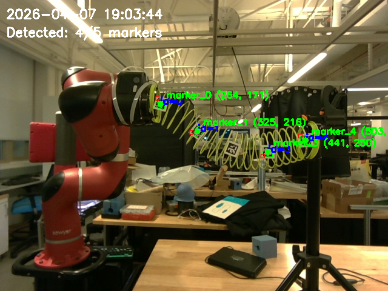
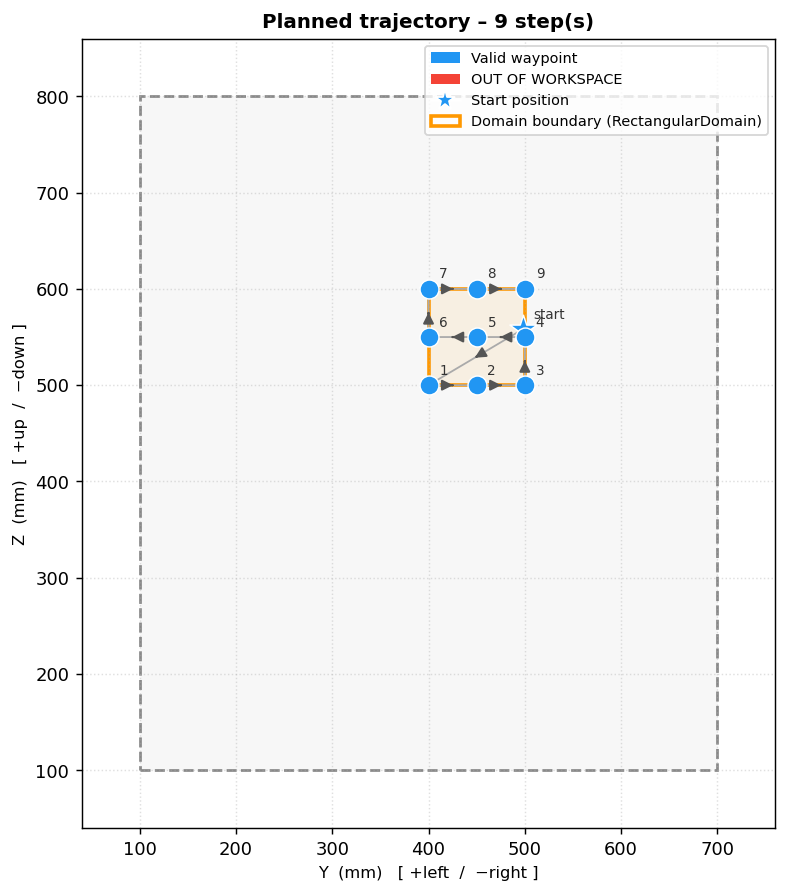

# LLM-Agents-Robotics

A framework for integrating LLM-based agents with robot control APIs and sensor data pipelines, focused on Deformable Linear Object (DLO) manipulation.

## Overview

This repository provides data collection code and an offline DLO dataset library for robot manipulation experiments.

Experiment setup:


## Repository Structure

```
src/
├── data_collection/    # Tools and scripts for collecting and storing experiment data
└── robot_API/          # Interface layer for robot control, camera access, and sensors
```

## DLO Library

An offline dataset library for Deformable Linear Object (DLO) experiments.

**Dataset access:** [Google Drive](https://drive.google.com/drive/folders/1sba59QFwaT6yMKejjck0-49RKjyyokpj?usp=sharing)

### Dataset Structure

```
shared/                         # Common configurations shared across experiments
DLO_<experiment_name>/
├── dataset/                    # Detailed experiment data
└── configs/                    # Per-dataset configuration files and visualizations
                                #   (first_frame.png, trajectory_preview.png, dataset_status.png)
```

### Example Data

| Camera Frame | Planned Trajectory |
|:---:|:---:|
|  |  |
